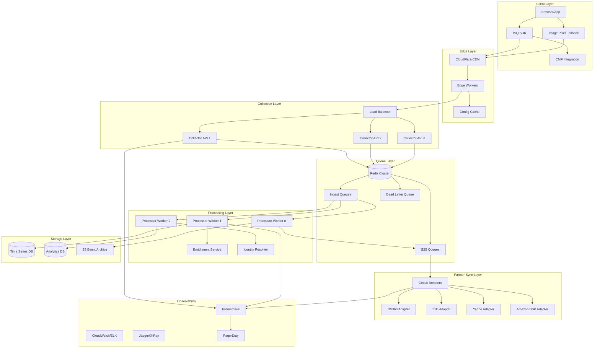
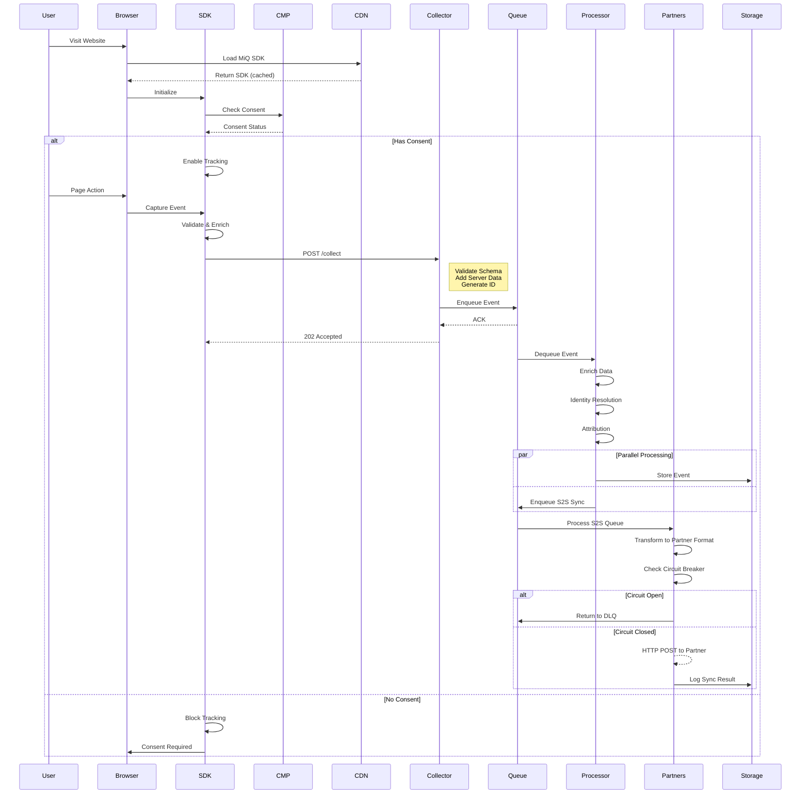
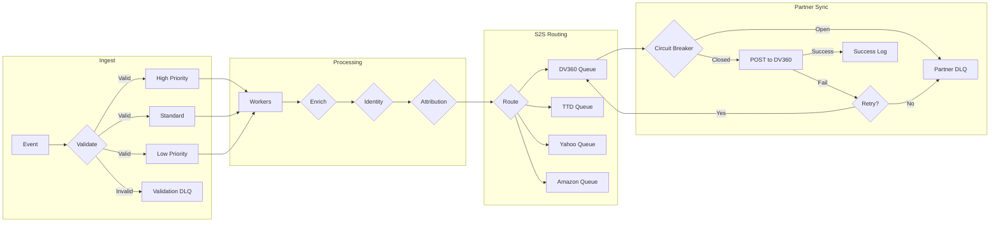
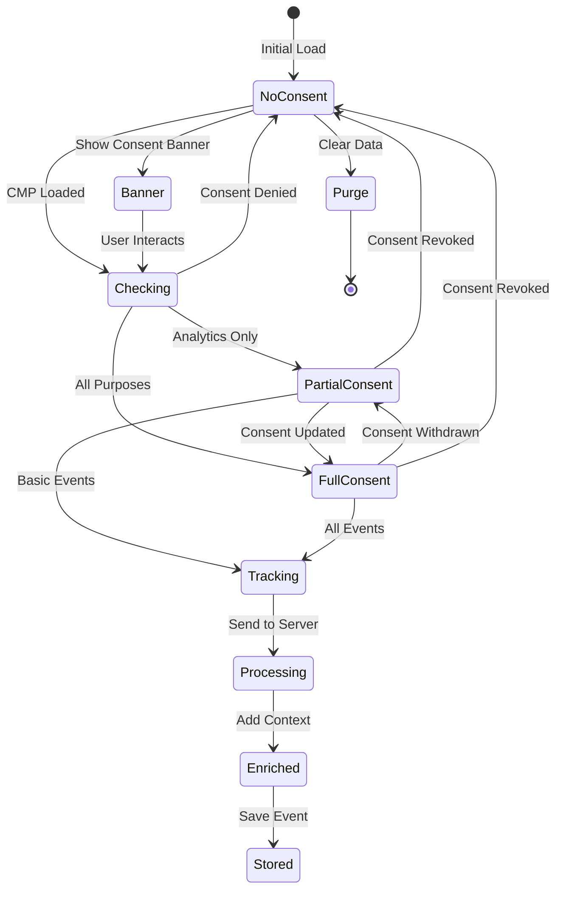

# MiQ Pixel System Architecture Diagrams

## High-Level System Architecture

```mermaid
graph TB
    subgraph "Client Layer"
        Browser[Browser/App]
        SDK[MiQ SDK]
        Pixel[Image Pixel Fallback]
        CMP[CMP Integration]
    end

    subgraph "Edge Layer"
        CDN[CloudFlare CDN]
        EdgeWorker[Edge Workers]
        ConfigCache[Config Cache]
    end

    subgraph "Collection Layer"
        LB[Load Balancer]
        API1[Collector API 1]
        API2[Collector API 2]
        APIn[Collector API n]
    end

    subgraph "Queue Layer"
        Redis[(Redis Cluster)]
        IngestQ[Ingest Queues]
        S2SQ[S2S Queues]
        DLQ[Dead Letter Queue]
    end

    subgraph "Processing Layer"
        Worker1[Processor Worker 1]
        Worker2[Processor Worker 2]
        Workern[Processor Worker n]
        Enrichment[Enrichment Service]
        Identity[Identity Resolver]
    end

    subgraph "Partner Sync Layer"
        CB[Circuit Breakers]
        DV360[DV360 Adapter]
        TTD[TTD Adapter]
        Yahoo[Yahoo Adapter]
        Amazon[Amazon DSP Adapter]
    end

    subgraph "Storage Layer"
        TimeSeries[(Time Series DB)]
        Analytics[(Analytics DB)]
        S3[S3 Event Archive]
    end

    subgraph "Observability"
        Metrics[Prometheus]
        Logs[CloudWatch/ELK]
        Traces[Jaeger/X-Ray]
        Alerts[PagerDuty]
    end

    Browser --> SDK
    Browser --> Pixel
    SDK --> CMP
    SDK --> CDN
    Pixel --> CDN
    CDN --> EdgeWorker
    EdgeWorker --> ConfigCache
    EdgeWorker --> LB
    LB --> API1
    LB --> API2
    LB --> APIn
    API1 --> Redis
    API2 --> Redis
    APIn --> Redis
    Redis --> IngestQ
    Redis --> S2SQ
    Redis --> DLQ
    IngestQ --> Worker1
    IngestQ --> Worker2
    IngestQ --> Workern
    Worker1 --> Enrichment
    Worker2 --> Identity
    Workern --> S2SQ
    S2SQ --> CB
    CB --> DV360
    CB --> TTD
    CB --> Yahoo
    CB --> Amazon
    Worker1 --> TimeSeries
    Worker2 --> Analytics
    Workern --> S3
    API1 --> Metrics
    Worker1 --> Metrics
    CB --> Metrics
    Metrics --> Alerts
```

## Data Flow Diagram

```mermaid
sequenceDiagram
    participant User
    participant Browser
    participant SDK
    participant CMP
    participant CDN
    participant Collector
    participant Queue
    participant Processor
    participant Partners
    participant Storage

    User->>Browser: Visit Website
    Browser->>CDN: Load MiQ SDK
    CDN-->>Browser: Return SDK (cached)
    Browser->>SDK: Initialize
    SDK->>CMP: Check Consent
    CMP-->>SDK: Consent Status
    
    alt Has Consent
        SDK->>SDK: Enable Tracking
        User->>Browser: Page Action
        Browser->>SDK: Capture Event
        SDK->>SDK: Validate & Enrich
        SDK->>Collector: POST /collect
        Note right of Collector: Validate Schema<br/>Add Server Data<br/>Generate ID
        Collector->>Queue: Enqueue Event
        Queue-->>Collector: ACK
        Collector-->>SDK: 202 Accepted
        
        Queue->>Processor: Dequeue Event
        Processor->>Processor: Enrich Data
        Processor->>Processor: Identity Resolution
        Processor->>Processor: Attribution
        
        par Parallel Processing
            Processor->>Storage: Store Event
            and
            Processor->>Queue: Enqueue S2S Sync
        end
        
        Queue->>Partners: Process S2S Queue
        Partners->>Partners: Transform to Partner Format
        Partners->>Partners: Check Circuit Breaker
        
        alt Circuit Open
            Partners->>Queue: Return to DLQ
        else Circuit Closed
            Partners-->>Partners: HTTP POST to Partner
            Partners->>Storage: Log Sync Result
        end
        
    else No Consent
        SDK->>SDK: Block Tracking
        SDK->>Browser: Consent Required
    end
```

## Queue Processing Flow

```mermaid
graph LR
    subgraph "Ingest"
        E1[Event] --> V1{Validate}
        V1 -->|Valid| Q1[High Priority]
        V1 -->|Valid| Q2[Standard]
        V1 -->|Valid| Q3[Low Priority]
        V1 -->|Invalid| DLQ1[Validation DLQ]
    end

    subgraph "Processing"
        Q1 --> W1[Workers]
        Q2 --> W1
        Q3 --> W1
        W1 --> E2{Enrich}
        E2 --> I1{Identity}
        I1 --> A1{Attribution}
    end

    subgraph "S2S Routing"
        A1 --> R1{Route}
        R1 --> QDV[DV360 Queue]
        R1 --> QTT[TTD Queue]
        R1 --> QY[Yahoo Queue]
        R1 --> QA[Amazon Queue]
    end

    subgraph "Partner Sync"
        QDV --> CB1{Circuit Breaker}
        CB1 -->|Open| DLQ2[Partner DLQ]
        CB1 -->|Closed| P1[POST to DV360]
        P1 -->|Success| S1[Success Log]
        P1 -->|Fail| RT1{Retry?}
        RT1 -->|Yes| QDV
        RT1 -->|No| DLQ2
    end
```

## Consent Flow State Machine

```mermaid
stateDiagram-v2
    [*] --> NoConsent: Initial Load
    NoConsent --> Checking: CMP Loaded
    Checking --> NoConsent: Consent Denied
    Checking --> PartialConsent: Analytics Only
    Checking --> FullConsent: All Purposes
    
    NoConsent --> Banner: Show Consent Banner
    Banner --> Checking: User Interacts
    
    PartialConsent --> Tracking: Basic Events
    FullConsent --> Tracking: All Events
    
    Tracking --> Processing: Send to Server
    Processing --> Enriched: Add Context
    Enriched --> Stored: Save Event
    
    PartialConsent --> FullConsent: Consent Updated
    FullConsent --> PartialConsent: Consent Withdrawn
    PartialConsent --> NoConsent: Consent Revoked
    FullConsent --> NoConsent: Consent Revoked
    
    NoConsent --> Purge: Clear Data
    Purge --> [*]
```